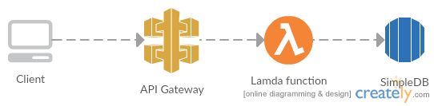

# Winfra

Winfra is a gem built by Wolox for Wolox to simplify the way infrastructure is created.

## Installation

Add this line to your application's Gemfile:

```ruby
gem 'winfra'
```

And then execute:

    $ bundle

Or install it yourself as:

    $ gem install winfra

## Usage

Winfra provides an easy way to create these infrastructure stacks:

1. A subscription endpoint involving Lambda, API Gateway and SimpleDB. This is mainly used by landing pages to save user's emails.
2. A Rails stack. This includes a AWS Elastic Beanstalk application and an RDS Postgresql database
3. An s3 bucket, either for holding files or to host a static website.

## Subscription endpoint

| Option        | Alias         | Required        | Description   |
| :-----------: | :-----------: | :-----------:   | :-----------: |
| --profile     | -             | true            | The aws profile to use |
| --path        | -p            | true            | The path where the files should be created|
| --env         | -e            | false           | The environment for which this templates will be created for. If no option is passed, default is `dev` |

This will create:

1. API Gateway with 2 endpoints: `POST /subscribers` and `GET /subscribers`
2. A Lambda function that's executed whenever a `GET` or `POST` is sent to the endpoint
3. A SimpleDB domain that will hold any information sent to the endpoint



Executing `winfra lambda-subscribe some-name --profile wolox -p .` will give the following directory structure:

```
|-- infrastructure
        |-- config.tf
        |-- dev-start-cloudwatch-rule.tf
        |-- dev-stop-cloudwatch-rule.tf
        |-- lambda-functions.tf
        |-- lambda-iam-role.tf
        |-- stack-sleep-awake
            |-- stack-start
            |   |-- index.js
            |-- stack-stop
            |   |-- index.js
            |-- start-beanstalk
            |   |-- index.js
            |-- start-rds
            |   |-- index.js
            |-- stop-beanstalk
            |   |-- index.js
            |-- stop-rds
                |-- index.js
```

After this, just `cd PATH/infrastructure` and run `terraform get && terraform plan`. This will output the plan to be executed against AWS. If you wish to apply the changes, run `terraform apply`.

## Rails Stack

| Option        | Alias         | Required        | Description   |
| :-----------: | :-----------: | :-----------:   | :-----------: |
| --profile     | -             | true            | The aws profile to use |
| --path        | -p            | true            | The path where the files should be created|
| --env         | -e            | false           | The environment for which this templates will be created for. If no option is passed, default is `dev` |

This will:

1. Create an Elastic Beanstalk application (`64bit Amazon Linux 2017.03 v2.4.0 running Ruby 2.3 (Puma)`) with the desired environment. The instance type will be `t2.medium`
2. Create an RDS `db.t2.micro` Postgresql database.
3. Allow Elastic Beanstalk's security group to access RDS
4. Create an IAM role and assign it as the instance profile for the EC2 instances

Executing `winfra rails-stack test --profile=wolox -p .` will create the following directory structure:
```
|-- infrastructure
    |-- beanstalk-dev.tf
    |-- config.tf
    |-- main-dev.tf
    |-- dev
        |-- beanstalk
        |   |-- beanstalk-role.tf
        |   |-- beanstalk-sg.tf
        |   |-- beanstalk.tf
        |   |-- outputs.tf
        |-- rds
            |-- outputs.tf
            |-- rds-sg.tf
            |-- rds.tf
```

After this, just `cd PATH/infrastructure` and run `terraform get && terraform plan`. This will output the plan to be executed against AWS. If you wish to apply the changes, run `terraform apply`.

## S3 Bucket

| Option        | Alias         | Required        | Description   |
| :-----------: | :-----------: | :-----------:   | :-----------: |
| --profile     | -             | true            | The aws profile to use |
| --path        | -p            | true            | The path where the files should be created|
| --env         | -e            | false           | The environment for which this templates will be created for. If no option is passed, default is `dev` |
| --public      | -a            | false           | If this bucket will hold a static website. Defaults to false. |

Options:

This will:

1. Create an S3 bucket with the corresponding permissions.
2. Create an IAM group with enough permissions for development

Executing `winfra s3_bucket my-bucket --profile wolox -p .` will create the following directory structure:
```
|-- infrastructure
    |-- config.tf
    |-- my-bucket.tpl
    |-- s3-my-bucket-dev.tf
    |-- dev
        |-- s3
            |-- my-bucket
                |-- s3-deploy-group.tf
                |-- s3.tf
```

After this, just `cd PATH/infrastructure` and run `terraform get && terraform plan`. This will output the plan to be executed against AWS. If you wish to apply the changes, run `terraform apply`.

## Stack On/Off

| Option        | Alias         | Required        | Description   |
| :-----------: | :-----------: | :-----------:   | :-----------: |
| --profile     | -             | true            | The aws profile to use |
| --path        | -p            | true            | The path where the files should be created|
| --env         | -e            | false           | The environment for which this templates will be created for. If no option is passed, default is `dev` |

Options:

This will:

1. Create a set of lambda functions.
2. Create a two cloudwatch rules that will execute the functions at 9PM ART and 8AM ART

Executing `winfra stack-sleep-awake --profile wolox -p .` will create the following directory structure:
```
|-- infrastructure
    |-- config.tf
    |-- dev-start-cloudwatch-rule.tf
    |-- dev-stop-cloudwatch-rule.tf
    |-- lambda-iam-role.tf
    |-- stack-start-lambda.tf
    |-- stack-stop-lambda.tf
    |-- start-beanstalk-lambda.tf
    |-- start-rds-lambda.tf
    |-- stop-beanstalk-lambda.tf
    |-- stop-rds-lambda.tf
    |-- stack-sleep-awake
        |-- stack-start
        |   |-- index.js
        |-- stack-stop
        |   |-- index.js
        |-- start-beanstalk
        |   |-- index.js
        |-- start-rds
        |   |-- index.js
        |-- stop-beanstalk
        |   |-- index.js
        |-- stop-rds
            |-- index.js
```

After this, just `cd PATH/infrastructure` and run `terraform get && terraform plan`. This will output the plan to be executed against AWS. If you wish to apply the changes, run `terraform apply`.

## AWS billing reports parser

| Option        | Alias         | Required        | Description   |
| :-----------: | :-----------: | :-----------:   | :-----------: |
| --profile     | -             | true            | The aws profile to use |
| --path        | -p            | true            | The path where the files should be created|

Options:

This will:

1. Creates a lambda function that knows how to parse billing reports.
2. Creates an s3 bucket that will hold AWS billing reports

Executing `winfra billing-parser {{project}}-billing --profile profile -p .` will create the following directory structure:
```
|-- infrastructure
    |-- main.tf
    |-- config.tf
    |-- billing
       |-- billing-bucket.tf
       |-- lambda-function.tf
       |-- lambda-iam-role.tf
       |-- billing-report-parser
           |-- elasticsearch_csv.js
           |-- index.js
           |-- package.json
```
It is important that the billing bucket is called {project}-billing. The lambda function parses the bucket name to index the data in elasticsearch.

After this, just `cd PATH/infrastructure` and run `terraform get && terraform plan`. This will output the plan to be executed against AWS. If you wish to apply the changes, run `terraform apply`.

You'll also need to enable reports in the [reports section](https://console.aws.amazon.com/billing/home?#/reports) and point them to that bucket.

## Development

After checking out the repo, run `bin/setup` to install dependencies. Then, run `rake spec` to run the tests. You can also run `bin/console` for an interactive prompt that will allow you to experiment.

To install this gem onto your local machine, run `bundle exec rake install`. To release a new version, update the version number in `version.rb`, and then run `bundle exec rake release`, which will create a git tag for the version, push git commits and tags, and push the `.gem` file to [rubygems.org](https://rubygems.org).

## Contributing

Bug reports and pull requests are welcome on GitHub at https://github.com/[USERNAME]/winfra. This project is intended to be a safe, welcoming space for collaboration, and contributors are expected to adhere to the [Contributor Covenant](http://contributor-covenant.org) code of conduct.


## License

The gem is available as open source under the terms of the [MIT License](http://opensource.org/licenses/MIT).
